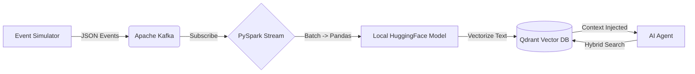

# Real-Time Context Engineering for Autonomous AI Agents (Streaming RAG)


## Overview
As enterprise companies shift from static chatbots to autonomous AI agents, standard batch-processed RAG (Retrieval-Augmented Generation) is too slow. For an AI assistant to feel "alive," it needs to know what the user did 30 seconds ago without asking them. 

This project is a Dynamic, Streaming RAG Pipeline. It captures raw user clickstream events, processes them in micro-batches, generates real-time vector embeddings using a local ML model, and streams them into a Vector Database to act as the "short-term memory" for an LLM.

## Architecture Flow



## Core Technologies

| Component | Technology |
|-----------|------------|
| Data Ingestion | Apache Kafka, Zookeeper (Docker Compose) |
| Stream Processing | PySpark (Structured Streaming, ```foreachBatch```) |
| AI / Machine Learning | HuggingFace ```all-MiniLM-L6-v2``` (Local Execution) |
| Vector Database | Qdrant (Local Docker) |
| Language | Python |

## Key Engineering Challenges Solved

### 1. Bypassing the LLM API Rate-Limiting Trap
When calling AI models within a distributed Spark job, executing row-by-row can easily DDoS external APIs (like OpenAI) and accrue massive costs.

**The Fix:** To ensure high throughput and zero API costs, this pipeline utilizes ```foreachBatch``` to pull micro-batches to the driver and runs a lightweight, open-source HuggingFace embedding model locally, avoiding external API rate limits entirely.

### 2. Overcoming "Semantic Bias" via Hybrid Search
By default, Vector Databases retrieve data based purely on mathematical meaning, ignoring time. If an AI agent looks for an "error", a standard Vector DB might fetch an error from 3 weeks ago rather than a shopping cart action from 10 seconds ago.

**The Fix:** The architecture implements a Hybrid Search algorithm. The Spark stream enriches the payload with User IDs and UNIX epoch timestamps. The AI Agent then queries Qdrant using strict Metadata Time Filtering (```Range(gte=five_minutes_ago```)) combined with Cosine Similarity, ensuring the AI only retrieves highly relevant, immediately recent context.

## Project Structure
```text
REAL-TIME_CONTEXT-ENGINEERING_PROJECT/
├── docker-compose.yml                  # Infrastructure definition (Kafka, Zookeeper, Qdrant)
├── event_simulator.py                  # Kafka Producer generating synthetic user interaction clickstreams
├── streaming_brain.py                  # PySpark application performing real-time UDF text-to-vector embedding and database upsertion
├── ai_agent.py                         # The AI retrieval mechanism demonstrating Hybrid Search context fetching     
└── requirements.txt                    # Python dependencies
```

## How to Run Locally

**1. Clone the repository**
```bash
git clone https://github.com/rtmagar/real-time_context-engineering_project.git
cd real-time_context-engineering_project
```
**2. Spin up the Infrastructure(Kafka & Qdrant)**
```bash
docker-compose up -d
```
**3. Initialize the local environment**
```bash
# Create Virtual Environment
python -m venv venv
source venv/bin/activate  # On Windows use: venv\Scripts\activate

# Install Dependencies
pip install -r requirements.txt
```
**4. Start the Event Simulator:**
Generates realistic user clickstream and error logs.
```bash
python event_simulator.py
```
**5. Start the Spark Streaming Engine:**
Consumes Kafka topics, vectorizes text locally, and upserts to Qdrant.
```bash
python streaming_brain.py
```
**6. Trigger the AI Agent:**
Executes the Hybrid Search to fetch a specific user's real-time context.
```bash
python ai_agent.py
```
